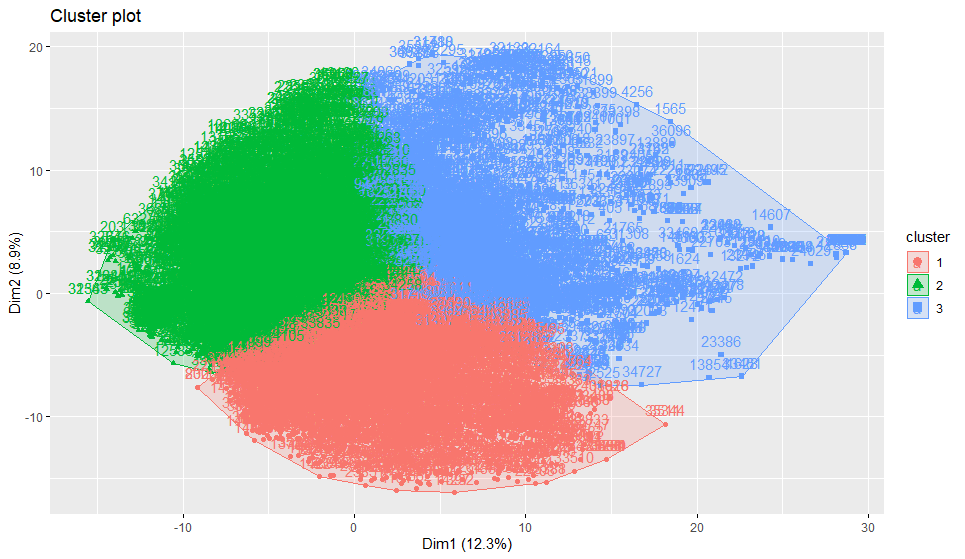

```{r setup, include=FALSE}
knitr::opts_chunk$set(echo = TRUE)
```


| Student name | Understand the report | Coding | Interpretation |
|:------|:-----:|:---------:|:------:|
| Thanh Hung Duong | 100% | 70% | 30% |
| Hsien Hao Hsu | 100% | 30% | 70% |


# Part 1 

## Detailed presentation of all the contents presented in Math6350 class during the lectures on **kNN automatic classification**

**Goal:** Automatically assign a class of cases to each cases

Number of classes is *N* $\rightarrow$ Classes : $C_1,C_2,...,C_N$, $C_j$ = class of group N cases

Overall, KNN automatic classification is a SUPERVISED machine learning model that try to predict output with input value base on how the output model's neighbor is classified.

Example : x describe the current state of engine - Blackbox

IBM $\rightarrow$ Peugeot or VW $\rightarrow$ analyze the data $\rightarrow$ Software in England to diagnosis and feedback


### Preliminary treatment of the data set

Divide the data set to Training set(N cases) and Test set(M cases). Each case $x_i = (x_{i,1},x_{i,2},...,x_{i,p})$, p features

Training set

|Case 1|Case 2|...|Case N
|---|---|---|---|
|$x_1$|$x_2$|...|$x_N$|

$y_i$ is name of class

Example 3 classes Good|OK|Bad ~ $C_1|C_2|C_3$

$y_1=3$="Good"
$y_N=1$="Bad"

**Machine learning**

Build a program = software = algorithms scan the training set $\rightarrow$ Generate a smart decision making software

#### Algorithm for KNN method

First we fix the k value we assume k = 9 and set the new data to be $z=(z_1,z_2,...,z_p)$

Then to find the nearest k neighbors we calculate the Euclidean distance. According to Euclidean distance formula, a distance between two points in a p dimensions which is the number of the features is given by

$dist_i(z)=\sqrt{(z_1-x_{i,1})^{2}+(z_2-x_{i,2})^{2}+...+(z_p-x_{i,p})^{2}}$ where i = 1,2,...,N

After we have calculated all the Euclidean distance of the unknown data point from all the points in Training set, we can sort all $dist_i(z)$ where i = 1,2,...,N from smallest to the largest e.g. $dist_3(z)<dist_7(z)<dist_{121}(z)<dist_{67}(z)<dist_{54}(z)<dist_{18}(z)<dist_{21}(z)<dist_{220}(z)<dist_{196}(z)<...$. After all, we can find the 9 smallest $dist_i(z)$ to be the 9 nearest neighbors for z. 

Hence we can see how many points of the 9 nearest neighbors fall into each class which is CL1, CL2 and CL3. Then z belongs to the class that get the largest amount of points.


### Evaluate model at the end 

we can evaluate the model performance of our KNN automatic classification by applying the confusion matrix

|     |||Predict Values|
|:---|:---:|:---:|:---:|:---:|
|||CL1|CL2|CL3|
|||---|---|---|
||CL1|$a_{11}$|$a_{12}$|$a_{13}$|
|Actual values|CL2|$a_{21}$|$a_{22}$|$a_{23}$|
||CL3|$a_{31}$|$a_{32}$|$a_{33}$|

The value of $a_{11}$ is the amount of number that we predict the data is in CL1 and the actual value is in CL1 so as $a_{22}$ and $a_{33}$. The acurracy of the acurracy rate will be $\frac{a_{11}+a_{22}+a_{33}}{a11+...+a33}$ which the dinominator is the size of the test set.

### How to choose K?

The performance of the model could be affected by the value of k or the size of the test set.Therefore, if we fix the test set, we can decide the best value of k by computing the accuracy rate.

### Weighted distance for KNN Algorithm

Additionally, we can do weighted distance to the Eucludean space we applied to find the k nearest neighbors as following 

$Dist_{i}(z)=\sqrt{w_1(z_1-x_{i,1})^{2}+w_2(z_2-x_{i,2})^{2}+...+w_p(z_p-x_{i,p})^{2}}$ where weight $w_1+w_2+...+w_p=1$

So how do we discover the weight? We select one of the features says the $i^{th}$ feature where $i=1,...,p$ then we discard all other features. Then we do KNN algorithm with the only $i^{th}$ feature and compute the performance under this condition. Eventually, we get p performances then we can denote that

$w_i=\frac{performance_i}{performance_1+...performance_p}$

### Retreatment for KNN 

The main reason to do retreatment for KNN algorithm is that we want to transform qualitative data to quantitative data. Moreover, by the retreatment for KNN algorithm, we can also transform discrete features to continuous features and discrete characteristics to continuous characteristics.

Let's take a socialogical (medical) data for example. Assume that one of the features in the original data set is the profession $pro=(pro_1,...,pro_{23})$. Then we make this feature transform to 23 numerical features, each of them are unit binary vector of length 23 

i.e. $pro_2=[0,1,0,0,0,...,0], pro_4=[0,0,0,1,0,...,0]$, $||pro_2-pro_4||^{2}=2 \rightarrow ||pro_2-pro_4||=\sqrt{2}$

Other features in the original data set:

$country=(cty_1,...,cty_{50})$

$race=(race_1,...,race_5)$

$Type Of Degree=(tod_1,...,tod_{15})$

$age=(5,11,...,74)$

$SAT=(404,536,...,1193)$

By using the same idea to all other nonnumrical features in the original data set which is the top three features above, we can get $23+50+5+15=93$ new features. For feature age and SAT they are already numerical features so we don't tranform they to the new fetures. Therefore, the final new numerical feature will be $93+2=95$ features. Eventually, we can do KNN algorithm to this data by it's new features $x=(x_1,...,x_{95})$.


# Part2 : Data Analysis

### Data Set Information:

```{r q0,cache=TRUE,warning=FALSE,message=FALSE}
rm(list=ls())
library(dplyr)
fon_nam = c('COURIER','CALIBRI','TIMES')
ful_dat=list()
# Import data 
for (fn in fon_nam){
  fdat=data.frame(read.csv(paste(fn,'.csv',sep = "")))
  ful_dat=bind_rows(ful_dat, fdat) #Merge vertically
}

#Discard 9 columns
drops = c('fontVariant','m_label','orientation','m_top','m_left','originalH','originalW','h','w')
ful_dat = ful_dat[,!(names(ful_dat) %in% drops)]

#Define DATA and CLi
oDATA = ful_dat[ which(ful_dat$strength==0.4 & ful_dat$italic ==0), ]
CL1 =oDATA[ which(oDATA$font==fon_nam[1]),]
CL2 =oDATA[ which(oDATA$font==fon_nam[2]),]
CL3 =oDATA[ which(oDATA$font==fon_nam[3]),]

nDATA=oDATA[c(-3:-1)]

#Standardlize the data set
#sData only contain numbers
sDATA=oDATA
sDATA[4:403]=scale(sDATA[4:403])
nDATA=data.matrix(sDATA[c(-3:-1)])

#Correlation matrix
corr=cor(nDATA)
ei=eigen(corr)
lamb=ei$values
Rj=cumsum(lamb)/400

```
## Question 1

#### Compute a = smallest integer j such that $R_j > 35$% , and b = smallest integer j such that $R_j > 60$%

Smallest integer j such that $R_j > 35$% is 5

Smallest integer j such that $R_j > 60$% is 16"

#### Fix a training set TRAIN of size NTRA ~ 80% N and a test set TEST of size NTST~ 20% N. 

In order to split the set sDATA evenly between the CLi, we applied the *sample.int* function to each CLi to split them with the ratio 80:20 and then combined the splitted set into the set TRAIN and TEST. Finally, we use sample(nrow(data)) to shuffle the set TRAIN and SET

N =13835  |  NTST=2768

|j|mj/NTST|nj/N|
|:---:|---:|---:|
|1|0.3082|0.3081|
|2|0.3447|0.3446|
|3|0.3472|0.3473|

```{r 2.1,cache=TRUE}
sta_tim=Sys.time()
#Find a
rtest=Rj-0.35
rtest=Rj[ which(rtest>0)]
a=which(Rj %in% rtest[1])
print(paste('Smallest integer j such that Rj >35% is', a))

#Find b
rtest=Rj-0.6
rtest=Rj[ which(rtest>0)]
b=which(Rj %in% rtest[1])
print(paste('Smallest integer j such that Rj >60% is', b))

#Split the data set into Train set and Test set rationally
#Data set will be splitted into 2 set : TRAIN and TEST
TRAIN=NULL 
TEST=NULL
for (i in 1:3){
  CL=sDATA[ which(sDATA$font==fon_nam[i]),]
  samp=sample.int(n=nrow(CL), size = floor(.8*nrow(CL)), replace = F)
  TRAIN=rbind(TRAIN,CL[samp,])
  TEST=rbind(TEST,CL[-samp,])
}
#Shuffle the set TRAIN and TEST
TRAIN= TRAIN[sample(nrow(TRAIN)),]
TEST= TEST[sample(nrow(TEST)),]

#Verify that the sizes m1 m2 m3 of classes CL1 , CL2, CL3 verify mj/NTST ~ nj /N for j=1,2,3
NTST=nrow(TEST)
N=nrow(sDATA)
for (i in 1:3){
  CL=TEST[ which(TEST$font==fon_nam[i]),]
  m=nrow(CL)
  n=nrow(sDATA[ which(sDATA$font==fon_nam[i]),])
  print(paste('For j =',i,', mj/NTST=',round(m/NTST,4),'vs nj/N ',round(n/N,4)))
}
end_tim=Sys.time()
print(paste('Computing time for question 1 is ',round(end_tim-sta_tim,2),' second'))
```
## Question 2:

We now describe each example # i from SDATA by the vector Ai belong Ra which lists the values of the new features Ai= [ scor1 (i), scor2 (i)., ,.scora (i) ] . Note that dim(Ai) = a. Give a geometric interpretation of Ai in terms of Ei. 

Fix k = 5 and apply kNN in the Euclidean space Ra to implement the automatic classification of all examples in the TEST set , using TRAIN as the training set, and using the new feature vectors Ai belong Ra . The three classes are CL1, CL2, CL3 , exactly as in HW2. Compute the percentage of successful classifications on TEST and on TRAIN, as well as the confusion matrices on TEST and on TRAIN.

```{r 2.2a}
# Find Ai
vm=ei$vectors[,1:5]
Ai=data.matrix(sDATA[c(-3:-1)])%*%vm
# Split Ai into train and test set
A.train=data.matrix(TRAIN[c(-3:-1)])%*%vm
A.test=data.matrix(TEST[c(-3:-1)])%*%vm

# Apply kNN on Ai
library(class) #load the library that contains knn function
cl.train=TRAIN$font # This will be the classes of the train set
cl.test=TEST$font
# Run knn function
sta_tim=Sys.time()
set.seed(100)
Ai.knn=knn(A.train,A.test,cl=cl.train,k=5)
Ai.cfm = table(cl.test,Ai.knn) #create confusion matrix
end_tim=Sys.time()
print('The confusion matrix of data set Ai is')
print(Ai.cfm)
# Check the accuracy
accuracy = function(x){sum(diag(x)/(sum(rowSums(x)))) * 100}
print(paste('The percentage of successful classifications on Ai is ',round(accuracy(Ai.cfm),2),"%", sep=""))
p_hat=round(accuracy(Ai.cfm),2)/100
std=sqrt(p_hat*(1-p_hat)/dim(A.test)[1])*100
print(paste('The 95% confidence interval of the performance on Ai is',round(accuracy(Ai.cfm),2),'\u00B1', round(1.6*std,2), '%'))
print(paste('The computing time is',round(end_tim-sta_tim,4),'second'))
```

#### Compare to the results already obtained in HW2 for kNN classification with k=5

```{r 2.2b}

# Compare with the accuracy of the sDATA
sD.train=data.matrix(TRAIN[c(-3:-1)])
sD.test=data.matrix(TEST[c(-3:-1)])
# Run knn function
sta_tim=Sys.time()
set.seed(200)
sDATA.knn=knn(sD.train,sD.test,cl=cl.train,k=5)
sDATA.cfm = table(cl.test,sDATA.knn) #create confusion matrix
end_tim=Sys.time()
print('The confusion matrix of data set sDATA is')
print(sDATA.cfm)
# Check the accuracy
print(paste('The percentage of successful classifications on sDATA is ',round(accuracy(sDATA.cfm),2),"%", sep=""))
p_hat=round(accuracy(sDATA.cfm),2)/100
std=sqrt(p_hat*(1-p_hat)/dim(sD.test)[1])*100
print(paste('The 95% confidence interval of the performance on sDATA is',round(accuracy(sDATA.cfm),2),'\u00B1', round(1.6*std,2), '%'))
end_tim=Sys.time()
print(paste('The computing time is',round(end_tim-sta_tim,4),'second'))
```
$\Rightarrow$ Although Ai contains only 35% of the data, the accuracy of kNN when apply to Ai set is signficantly high and it is only lower around 10% than the accuracy of the automatic classification on the set sDATA. Moreover, the their computing times are totally different. It only took below 0.3 second to train and test the algorithm on set Ai while the computing time for sDATA is around 1 minutes.

## Question 3 :

#### Repeat the preceding automatic classification by kNN with k=5, but based on the vectors $G_i \in R^{b-a}$ listing the values of the (b-a) new features :

```{r 2.3,cache=FALSE}
# Find Gi
g.vm=ei$vectors[,a+1:b]
# Split Gi into train and test set
G.train=data.matrix(TRAIN[c(-3:-1)])%*%g.vm
G.test=data.matrix(TEST[c(-3:-1)])%*%g.vm

# Apply kNN on Gi
cl.train=TRAIN$font # This will be the classes of the train set
cl.test=TEST$font
# Run knn function
sta_tim=Sys.time()
set.seed(150)
Gi.knn=knn(G.train,G.test,cl=cl.train,k=5)
Gi.cfm = table(cl.test,Gi.knn) #create confusion matrix
end_tim=Sys.time()
print('The confusion matrix of data set Gi is')
print(Gi.cfm)
# Check the accuracy
print(paste('The percentage of successful classifications on Gi is ',round(accuracy(Gi.cfm),2),"%", sep=""))
p_hat=round(accuracy(Gi.cfm),2)/100
std=sqrt(p_hat*(1-p_hat)/dim(G.test)[1])*100
print(paste('The 95% confidence interval of the performance on Gi is',round(accuracy(Gi.cfm),2),'\u00B1', round(1.6*std,2), '%'))
print(paste('The computing time is',round(end_tim-sta_tim,4),'second'))
```


$\Rightarrow$ Despite containing only 25% information of the data, the accuracy of the automation classification based on Gi is higher than that based on Ai and clearly lower than the percentage of successful classification applied on sDATA. The interpretation for it may be that Gi use 11 eigen vectors while Ai is based on 5 eigen vectors. Besides, the computing time for Gi is between times of Ai and sDATA. Moreover, it is below 0.5 second, which is so much better than the trainning time on sDATA. We can conclude that number of used eigen vectors affect the accuracy of the automation successful classification stronger than the percentage of used information.

## Question 4

Use the feature vectors Ai $\in R^a$ and apply the unsupervized Kmean algorithm in Ra to implement automatic clustering of the TRAIN data into 3 sets H1, H2, H3. Repeat 10 times the implementation of Kmean with different random initializations for the centers of H1 H2 H3. Describe precisely the Cost function Cost(H1,H2,H3) which the Kmean algorithm attempts to minimize. For each implementation of Kmean, compute the terminal value of the Cost(H1,H2,H3). List these 10 terminal Costs and select the clustering result H1 H2 H3 achieving the smallest terminal cost

In R, **kmeans** function try to minimize the component *tot.withinss*,which is the total within-cluster sum of squares. And this component is the Cost(H1,H2,H3)

```{r 2.4,cache=TRUE}
sta_tim=Sys.time()
A.cluster=NULL
cost=Inf
set.seed(10)
print('The terminal value of the Cost(H1,H2,H3):')
for (i in 1:10){
  clus = kmeans(A.train,3,nstart = 1)
  print(paste('Value#',i,':',  round(clus$tot.withinss)))
  if (cost>clus$tot.withinss){
    cost=clus$tot.withinss
    A.cluster=clus
  }
}
end_tim=Sys.time()
print(paste('The minimum terminal cost is',round(A.cluster$tot.withinss)))
print(paste('Computing time for question 4 is ',round(end_tim-sta_tim,2),' second'))
```


## Question 5

To compare the computed clustering H1 H2 H3 to the "ideal" clustering CL1 CL2 CL3, we first compute Cost(CL1,CL2,CL3) and compare to Cost (H1,H2,H3). To get more concrete information , compute for i=1,2,3 and j=1,2,3 all the percentages Pij = size(Hi $cap$ CLj)/ size(CLj) and Qij = size(Hi $\cap$ CLj)/ size(Hi)

```{r 2.5,cache=TRUE}
sta_tim=Sys.time()
#identify H1,H2,H3
pre_dat=TRAIN
pre_dat$font=A.cluster$cluster
#h1.tr=A.train
H1=pre_dat[ which(pre_dat$font==1),]
H2=pre_dat[ which(pre_dat$font==2),]
H3=pre_dat[ which(pre_dat$font==3),]
H1=data.matrix(H1[c(-3:-1)])
H2=data.matrix(H2[c(-3:-1)])
H3=data.matrix(H3[c(-3:-1)])

#identify new CL1,CL2,CL3

CL1=TRAIN[ which(TRAIN$font==fon_nam[1]),]
CL2=TRAIN[ which(TRAIN$font==fon_nam[2]),]
CL3=TRAIN[ which(TRAIN$font==fon_nam[3]),]
CL1=data.matrix(CL1[c(-3:-1)])
CL2=data.matrix(CL2[c(-3:-1)])
CL3=data.matrix(CL3[c(-3:-1)])

#a function to calculate cost of a cluster
cost_f= function(df) {
  center=colMeans(df)
  cost=sum((df-center)^2)
  return(cost)
}

tot_cos_h=cost_f(H1)+cost_f(H2)+cost_f(H3)
print(paste('The new Cost(H1,H2,H3) is', round(tot_cos_h)))
tot_cos_h=cost_f(CL1)+cost_f(CL2)+cost_f(CL3)
print(paste('The Cost(CL1,CL2,CL3) is',round(tot_cos_h)))

#Compare percentage Pij and Qij
pre_fon=NULL
for (i in 1:length(pre_dat$font)){
  pre_fon[i]=fon_nam[pre_dat$font[i]]
}

cfm=table(pre_fon,TRAIN$font) #Compare predict values in H1,H2,H3 and true values in CL1,CL2,CL3
cfm=data.frame(cfm)
cfm$sizeCL=rep(c(dim(CL2)[1],dim(CL1)[1],dim(CL3)[1]),3)
cfm$sizeH=rep(c(dim(H2)[1],dim(H1)[1],dim(H3)[1]),3)
cfm$pij=round(cfm$Freq/cfm$sizeCL,4)
cfm$qij=round(cfm$Freq/cfm$sizeH,4)
cfm=cfm[c(2,1,3,4,5,6,8,7,9),] #reorder the rows because it automatically placed value in alphabet order

Pij=matrix(cfm$pij,3,3)
Qij=matrix(cfm$qij,3,3)
colnames(Pij)=c('CL1','CL2','CL3')
rownames(Pij)=c('H1','H2','H3')
print('Precentages Pij is')
print(Pij*100)
colnames(Qij)=c('CL1','CL2','CL3')
rownames(Qij)=c('H1','H2','H3')
print('Precentages Qij is')
print(Qij*100)

end_tim=Sys.time()
print(paste('Computing time for question 5 is ',round(end_tim-sta_tim,2),' second'))
```

In the question 4, we used matrix Ai, which has only 5 features, for kmean algorithm. In this question, we applied the prediction in the question 4 onto the set TRAIN to obtain matrix H1,H2,H3 that have full 400 features so that we can compare them with CL1,CL2,CL3. Because of the difference between the number of features, the cost(H1,H2,H3) is higher almost 4 times that in question 4.

Originally, CL1,CL2,CL3 are obtained by splitting the sDATA, which contains 100% data information. In order to be comparable with H1,H2,H3, we created new CL1,CL2,CL3 from the set TRAIN, which has 80% data information.

Assuming that the margin of error at 95% confidence level for cost is $\sim 0.98/ \sqrt{n}$, with n= size(CL1+CL2+CL3)=11067

$\rightarrow$ Cost(H1,H2,H3)= 4383325 $\pm$ 40833

And Cost(CL1,CL2,CL3)= 4451371 $\pm$ 41467

The difference between two costs is 68046

error for the different is $1.6 \times \sqrt{\sigma_1^2+\sigma_2^2}$= 93114

$\Rightarrow |C_1-C_2|<1.6 \times \sqrt{\sigma_1^2+\sigma_2^2} \rightarrow$ The difference between two Cost(H1,H2,H3) and Cost(CL1,CL2,CL3) are **insignificant**. Or Cost(CL1,CL2,CL3) may be equal Cost(H1,H2,H3)

**To get more concrete information** we calculated Pij and Qij to check whether if the clusters Hi is close to cluster CLi

If both Pij and Qij close to 100%, it means that Cij and Hij are close to each other

If both Pij and Qij close to 0%, it means that Cij and Hij are far to each other

Based on the table of Pij and Qij, **the pairs that are close to each other are :H1 and CL1, H1 and CL2, and CL3 and H2**. 

Moreover, by using the *fviz_cluster* function, we can see how kmeans function classify the class for set TRAIN in 2 dimension (it uses the first two vector)



